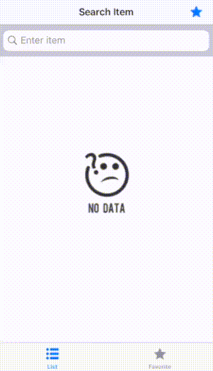

## Gasungbi
> 이 앱은 Naver 서비스 API (검색) 를 사용하여 네이버 쇼핑 검색 결과를 보여줍니다.</br> 사용자는 좋아하는 물건을 선택하여 북마크 추가나 삭제를 할 수 있습니다.</br> 테이블 행을 클릭하면 자세한 가격정보를 볼 수 있습니다.</br> 사용자는 가격정보를 SNS나 메모장에 저장할 수 있습니다. 
---
This app shows item price from Naver Shopping.</br> Users can add or delete favorite items.
When click table row, it shows detail price information.</br> User can share price information from SNS or Memo app.

## Overview 
1. Search items and check price on tableview 
2. User can select favorite items
3. Just click item, user check detail price
4. Share detail price link using memo and SNS
---
1) 제품명을 입력하면, 바로 네이버쇼핑의 최저가를 테이블에서 볼 수 있습니다.
2) 사용자는 좋아하는 아이템을 선택하여, 따로 담아둘 수 있습니다.
3) 아이템을 클릭하면 타사이트 가격정보를 볼 수 있습니다.
4) 가격 정보 링크는 SNS와 메모장에 공유할 수 있습니다.

## CocoaPods
This project have Podfile. You have to enter directory in terminal.
Type this.

```ruby
pod install
```

## Video
<p float="left">
  
</p>

## Technical Usage
- Rest API to interact with [Naver Open API](https://developers.naver.com/docs/search/shopping/)
- Downloading data from network resources 
- Researching and leveraging a new framework or library  
   * network library : [Alamofire](https://github.com/Alamofire/Alamofire)
   * Swift library for downloading and caching images from the web : [Kingfisher](https://github.com/onevcat/Kingfisher)
   * simple JSON Object mapping library : [ObjectMapper](https://github.com/tristanhimmelman/ObjectMapper)
   * Load webpage using : [WebViewWarmUper](https://github.com/bernikovich/WebViewWarmUper)
- Multiple select table view 
- Keep favorites list using Core Data 


            
