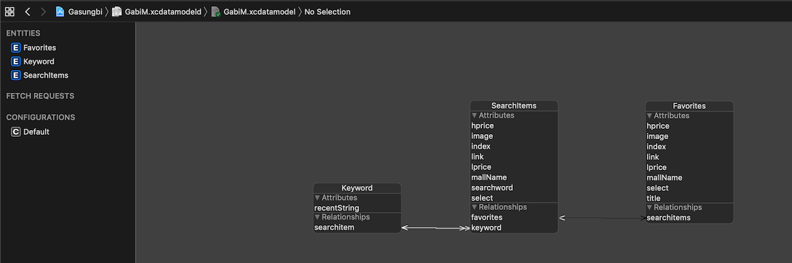

## Gasungbi
이 앱은 Naver 서비스 API (검색) 를 사용하여 네이버 쇼핑 검색 결과를 보여줍니다.</br> 사용자는 좋아하는 물건을 북마크를 할 수 있습니다.

> This app shows Naver shopping search results using the Naver Service API (search).</br> Users can bookmark their favorite items.

## Features 

- Search any items, and add / delete favorite items
- Refresh search result and share url 

## Requirements

- Xcode 10.3
- Swift 5

## Data Model


### CocoaPods
This project have Podfile. You have to enter directory in terminal.
Type this.

```ruby
pod install
```

## License
This code is free and open source and I have build this project for my Udacity submission.

            
